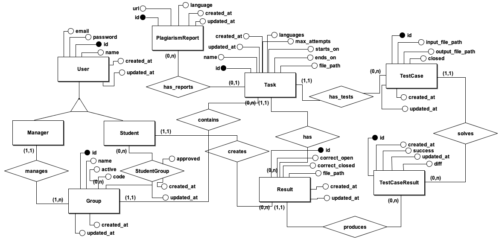
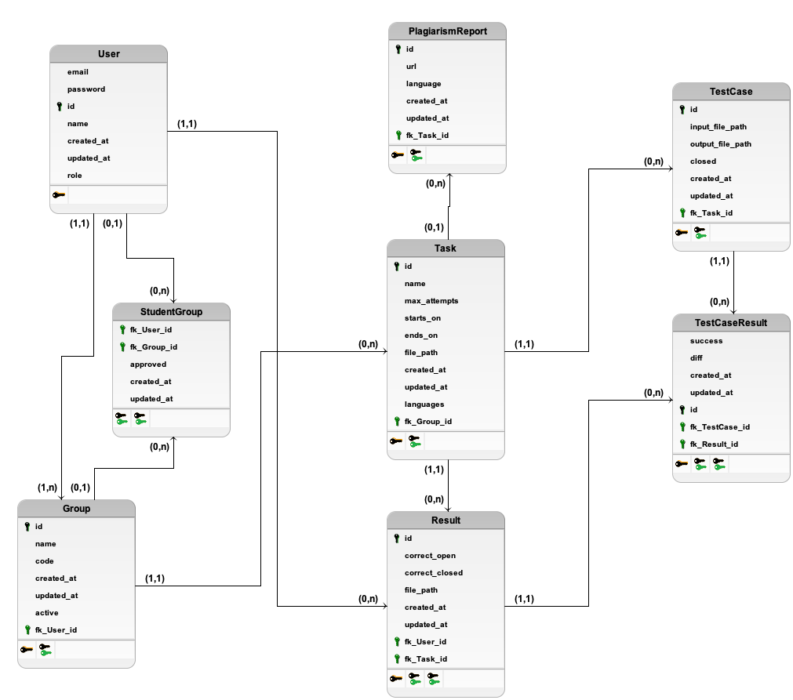

# Codemaze

[](https://github.com/danilobecke/codemaze/actions/workflows/test.yml)  [](https://github.com/danilobecke/codemaze/actions/workflows/lint.yml) [](https://github.com/danilobecke/codemaze/actions/workflows/mypy.yml)

Codemaze is an advanced platform specifically designed to enhance the programming education experience in higher education. Providing a virtual environment for code execution, Codemaze allows users to practice, test, and evaluate their programs across various programming languages. Furthermore, the software integrates powerful features including plagiarism detection reports, detailed logging capabilities, and Swagger documentation for easy reference. With support for adding programming languages, customizable configurations, and a flexible architecture built on Docker containers, Codemaze empowers both instructors and higher education students to collaboratively and efficiently explore the realm of programming.

## Table of contents

1. [Prerequisites](#prereq)
2. [Deploy](#deploy)
	1. [Environment](#env-deploy)
	4. [Configuration](#config)
2. [Plugins](#plugins)
	1. [Plagiarism report](#plagrep)
	4. [Logs](#logs)
4. [Swagger](#swagger)
5. [Contributing](#contr)
	1. [Running as debug](#debug)
	1. [Testing](#tests)
	1. [Adding Supported Programming Languages](#add-runner)
	7. [Modelling](#mod)
		1. [ERD](#erd)
		8. [DSD](#dsd)
1. [Stopping](#stop)
1. [License](#lic)
2. [Technologies](#tech)
1. [Contact Info](#contact)

<a name=prereq></a>
## Prerequisites

You must have installed in the host machine before deploying or in your local machine before running:

1. **Docker** - used to manage the database, the deploy-container, and sandbox environments for the [runners](#add-runner).

<a name=deploy></a>
## Deploy

Clone this repository in the host machine and run:

```sh
make build
make run
```

By doing this, Codemaze will be running in the `:8080` port. You can customize the port updating the [compose.deploy.yaml](./compose.deploy.yaml).

<a name=env-deploy></a>
### Environment
Optionally, you can create an environment file on the root directory named `.env.deploy` with keys for the supported [plugins](#plugins) ([plagiarism report](#plagrep) and [logs](#logs)):

```bash
MOSS_USER_ID="999999999"
PAPERTRAIL_ADDRESS="logsN.papertrailapp.com:XXXXX"
```
<a name=config></a>
### Configuration
The [config.toml](./config.toml) file contains admin-level settings:

| Key   |      Description      |  Kind |
|----------|:-------------:|:------:|
| `managers-mail-list` | [Can be empty] - if not empty, list of emails allowed to register as manager. | Strings array |
| `task-max-size-mb` | Max size allowed for each task description (MB). | Float |
| `test-max-size-mb` | Max size allowed for each test case (MB). | Float |
| `code-max-size-mb` | Max size allowed for each source code (MB). | Float |
| `timeout` | Timeout for the student's code run (seconds). | Float |
| `max-memory-mb` | Max memory allowed to be used for each container running students' code (MB). | Integer |
| `gcc-parameters` | Compilation flags for the GCC (C compiler). | String |

<a name=plugins></a>
## Plugins

The following plugins are optional but improve the Codemaze experience.

<a name=plagrep></a>
### Plagiarism Report

Codemaze uses **Stanford's MOSS** as a plagiarism report tool. This is optional, but if you want it to work, the following steps must be followed:

#### Get a user ID:

Send an email to [moss@moss.stanford.edu](mailto:moss@moss.stanford.edu) with:

Subject: **New Account**

Message:

```
registeruser
mail email@mail.com
```

replacing *email@mail.com* with your email.

From the response, search for `$userid=` and save your user ID.

#### Edit the .env file

Add your user ID as the environment var `MOSS_USER_ID` in your .env file(s). See [.env.deploy](#env-deploy), [.env.test](#tests), and [.env.debug](#debug).

<a name=logs></a>
### Logs

Codemaze will keep logs from the past **10 days** in the `/logs` directory. Optionally, you can have your logs on Papertrail. To do so, the following steps must be followed:

#### Get a destination address:

1. Create an account on [https://papertrailapp.com/signup](https://papertrailapp.com/signup?plan=free);
2. Go to *Settings* and *Log Destinations*;
3. Copy your address. Format: *logsN.papertrailapp.com:XXXXX*;

#### Add the env var

Add your destination address as the environment var `PAPERTRAIL_ADDRESS` in your .env file(s). See [.env.deploy](#env-deploy), [.env.test](#tests), and [.env.debug](#debug).

<a name=swagger></a>
## Swagger - v1

The Swagger documentation is hosted at the `/api/v1/docs` URL.

<a name=contr></a>
## Contributing

You can run Codemaze locally for debugging and testing purposes:

<a name=debug></a>
### As debug (localhost:48345)

Navigate to the root folder and run:

```bash
make setup-debug
make debug
```

Optionally, you can have a `.env.debug` file in the same way as the [.env.deploy](#env-deploy) one.

<a name=tests></a>
### Tests

Navigate to the root folder and run:

```bash
make setup-test
make test # or make smoke-test
```

Optionally, you can have a `.env.test` file in the same way as the [.env.deploy](#env-deploy) one.

<a name=add-runner></a>
### Adding Supported Programming Languages

In order to add support for another programming language, you must implement a class inheriting from the [Runner class](./code/services/runner/runner.py) and add an object of this class in the runner's list of the [RunnerService](./code/services/runner_service.py#19). Each runner must have its own Docker Container and run the student's code inside of it. See [CRunner](./code/services/runner/c_runner.py) and [this commit](48d0869a0c50ae149edec305b8570c38c858a376) for reference.

<a name=mod></a>
### Modelling

<a name=erd></a>
#### Entity-Relationship Diagram (ERD)



<a name=dsd></a>
#### Data-Structure diagram (DSD)



<a name=stop></a>
## Stopping

To stop and remove the Docker containers, you can run:

```bash
make stop-deploy # if deploy
make stop-debug # if debugging
make stop-test # if testing
```

<a name=lic></a>
## License

Introduced by Danilo Cleber Becke in 2023, the BSD 2-Clause License outlines the terms under which the software can be utilized and distributed. Users are free to modify the software, as long as they adhere to two main conditions: 1) they must include the original copyright notice and a list of conditions, and 2) if they distribute the software in binary form, they must reproduce the copyright notice and conditions in the documentation or accompanying materials. The copyright holder and contributors are not liable for any direct, indirect, incidental, consequential, or other damages arising from the use of the software, regardless of the legal theory applied.

<a name=tech></a>
## Technologies

- [coverage-badge](https://pypi.org/project/coverage-badge/)
- [Docker](https://www.docker.com)
- [Flask](https://flask.palletsprojects.com/en/2.3.x/)
- [flask-restx](https://flask-restx.readthedocs.io/en/latest/)
- [MOSS](https://theory.stanford.edu/~aiken/moss/)
- [mosspy](https://pypi.org/project/mosspy/)
- [mypy](https://mypy-lang.org)
- [Papertrail](https://www.papertrail.com)
- [pip-autoremove](https://pypi.org/project/pip-autoremove/)
- [PostgreSQL](https://www.postgresql.org)
- [pyclean](https://pypi.org/project/pyclean/)
- [PyJWT](https://pyjwt.readthedocs.io/en/stable/)
- [pylint](https://pylint.readthedocs.io/en/latest/#)
- [pytest](https://docs.pytest.org/en/7.3.x/)
- [pytest-cov](https://pytest-cov.readthedocs.io)
- [python-dotenv](https://pypi.org/project/python-dotenv/)
- [SQLAlchemy](https://www.sqlalchemy.org)
- [SQLAlchemy-Utils](https://sqlalchemy-utils.readthedocs.io/en/latest/)
- [uWSGI](https://uwsgi-docs.readthedocs.io)

<a name=contact></a>
## Contact Info

You can reach me at [danilobecke@gmail.com](mailto:danilobecke@gmail.com) and [http://linkedin.com/in/danilobecke/](http://linkedin.com/in/danilobecke/).
