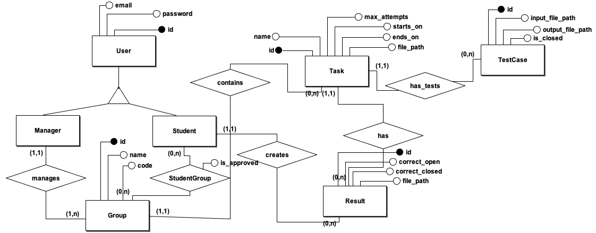
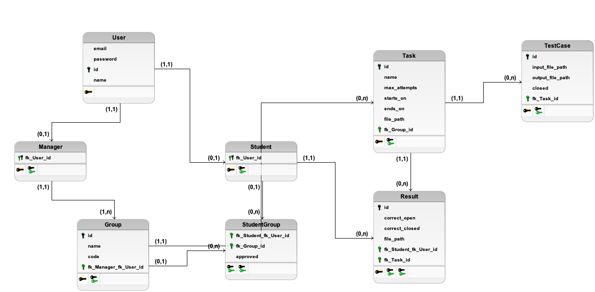

# Codemaze

[](https://github.com/danilobecke/codemaze/actions/workflows/test.yml)  [](https://github.com/pylint-dev/pylint) [](http://mypy-lang.org/)

## Prerequisites

You must have installed before installing the requirements:

1. **PostgreSQL** - used as the project's database;
2. **Docker** - used as a sandbox to run students' code in a safe environment.

## Install Requirements

Install all requirements by going to the root folder and running:

```bash
make setup
```

## Running

The environment variable `CODEMAZE_KEY` must be set with the secret that will be used to generate JWTs. It must be a 256 bit string and can be generated by running the following python script:

```python
import secrets

secrets.token_bytes(32)
```

This project uses `python-dotenv`, which means you can have a `.env` file in the project's root directory with the required environment variables instead of having them exported into your system. Example:

```
CODEMAZE_KEY="=your-secret"
DEBUG_DB_STRING="postgres://your@debug_url"
TEST_DB_STRING="postgresql://your@test_url"
```

### As debug (localhost:48345)

The environment variable `DEBUG_DB_STRING` must be set with the debug database string or an exception will be raised.

Navigate to the root folder and run:

```bash
make run
```

### Tests

The environment variable `TEST_DB_STRING` must be set with the testing database string or an exception will be raised.

Navigate to the root folder and run:

```bash
make test
```

## Stopping

To stop and remove the Docker containers, you can run:

```bash
make stop
```

## Swagger - v1

The Swagger documentation is hosted at the `/api/v1/docs` URL.

## Modelling

### Entity-Relationship Diagram (ERD)



### Data-Structure diagram (DSD)



## Technologies

- [coverage-badge](https://pypi.org/project/coverage-badge/)
- [Docker](https://www.docker.com)
- [Flask](https://flask.palletsprojects.com/en/2.3.x/)
- [flask-restx](https://flask-restx.readthedocs.io/en/latest/)
- [mypy](https://mypy-lang.org)
- [PostgreSQL](https://www.postgresql.org)
- [pyclean](https://pypi.org/project/pyclean/)
- [PyJWT](https://pyjwt.readthedocs.io/en/stable/)
- [pylint](https://pylint.readthedocs.io/en/latest/#)
- [pytest](https://docs.pytest.org/en/7.3.x/)
- [pytest-cov](https://pytest-cov.readthedocs.io)
- [python-dotenv](https://pypi.org/project/python-dotenv/)
- [SQLAlchemy](https://www.sqlalchemy.org)
- [SQLAlchemy-Utils](https://sqlalchemy-utils.readthedocs.io/en/latest/)
